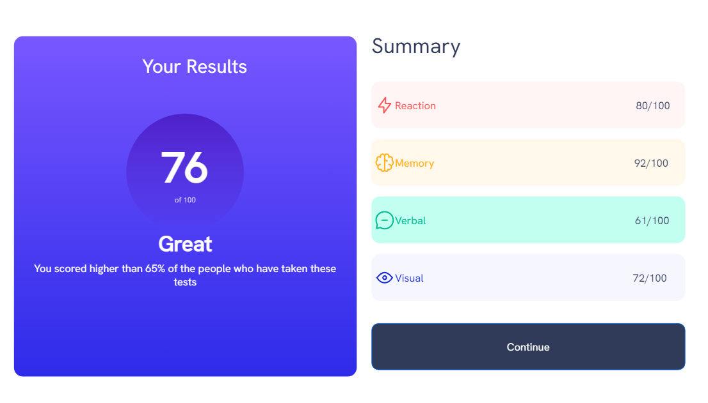

# Frontend Mentor - Results summary component solution

This is a solution to the [Results summary component challenge on Frontend Mentor](https://www.frontendmentor.io/challenges/results-summary-component-CE_K6s0maV). Frontend Mentor challenges help you improve your coding skills by building realistic projects. 

## Table of contents

- [Overview](#overview)
  - [The challenge](#the-challenge)
  - [Screenshot](#screenshot)
  - [Links](#links)
- [My process](#my-process)
  - [Built with](#built-with)
  - [What I learned](#what-i-learned)
  - [Continued development](#continued-development)
  - [Useful resources](#useful-resources)
- [Author](#author)


## Overview

### The challenge

Users should be able to:

- View the optimal layout for the interface depending on their device's screen size
- See hover and focus states for all interactive elements on the page

### Screenshot



### Links

- Solution URL: [Github]()
- Live Site URL: [Live Github]()

## My process

### Built with

- Semantic HTML5 markup
- Bootstrap
- Sass/SCSS
- Javascript/Jquery
- Mobile-first workflow

### What I learned

- For accessiblity it's still currently advisable to use both the HTML5 elements and the corresponding WAI-ARIA roles, but I removed it as frontendmentor marked it as an error.
- Retrieving the JSON data with fetch() a slightly different way using response.json() instead of response.text() and parsing.
- I tried speeding up the JSON data displaying by placing either of the following lines of code beneath the forEach loop in displayData()
  ```   data.forEach((element,index) => {
	       string+=(`<p> ${element.category}  <span class='right-dark-font${index}'>${element.score}<span class='inherit-position light-font'>/100</span></span></p>`);
        });
	    replaceHtml('.results', string)
  ```
  as well as
  ```data.forEach((element,index) => {
	    array.push(`<p> ${element.category}  <span class='right-dark-font${index}'>${element.score}<span class='inherit-position light-font'>/100</span></span></p>`);
     });
	 results.innerHTML = array.join(' ');
   
  ```
  and lastly
  ```
    data.forEach((element,index) => {
	    string+=`<p> ${element.category}  <span class='right-dark-font${index}'>${element.score}<span class='inherit-position light-font'>/100</span></span></p>`;
    });
	$('.results').append(string);
  ```
  
  And the screenshot in frontendmentor still wouldn't display. It worked fine to retrieve JSON data in my [expenses chart component main project](https://github.com/cmb347827/expenses-chart-component-main)
- Finally I tried using a github.raw link again instead of corsproxy.io and jsonkeeper, and it worked fast enough so the screenshot works correctly.
  
### Continued development

- Daily tutorials and projects in HTML5, CSS3, Javascript, Bootstrap, Sass/SCSS. For now, in time I will go re-learn React ect.

### Useful resources

[WAI region tutorial](https://www.w3.org/WAI/tutorials/page-structure/regions/)

[Writing JS with accessiblity in mind](https://medium.com/@matuzo/writing-javascript-with-accessibility-in-mind-a1f6a5f467b9)

[append vs html vs innerHTML performance](https://stackoverflow.com/questions/18393981/append-vs-html-vs-innerhtml-performance)

[replaceHTML](https://blog.stevenlevithan.com/archives/faster-than-innerhtml)


## Author

- Website - [One of my latest codepens](https://codepen.io/cynthiab72/pen/oNybYON)
- Frontend Mentor - [@cmb347827](https://www.frontendmentor.io/profile/cmb347827)

